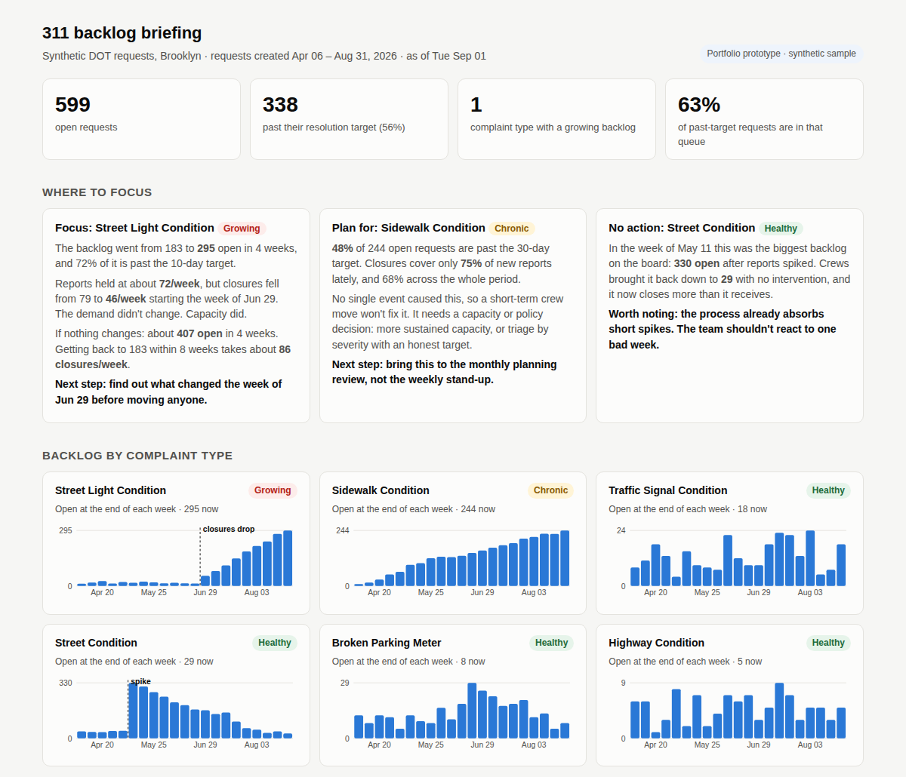

# NYC 311 Backlog Triage

**A city team has a pile of open service requests. Which queue actually needs attention this week, and which one only looks bad?**

311 dashboards usually show counts: how many requests are open, how many came in. Counts alone don't tell a team lead what to do. The biggest backlog might be shrinking on its own, and a mid-sized one might be quietly doubling. This project takes a 311 extract and sorts every complaint type into one of three situations, because each needs a different response:

| Status | What it means | Right response |
|---|---|---|
| **Growing** | Backlog is rising because closures fell or reports rose | Find out what changed, then act this week |
| **Chronic** | Most open requests are past target, and it's been that way all along | A planning decision (capacity, policy), not a crew move |
| **Healthy** | Closing at least as fast as requests arrive | Leave it alone, even if it had a bad week |

It then writes a one-page briefing a team lead could read in two minutes.

> **Portfolio prototype.** The code is written for the real [NYC 311 Service Requests](https://data.cityofnewyork.us/Social-Services/311-Service-Requests-from-2010-to-Present/erm2-nwe9) dataset, and `triage/fetch.py` downloads it. The results and screenshot below come from a **synthetic sample in the same schema** (`data/sample_311_requests.csv`), so the repo runs offline and the tests have known answers. The resolution targets are my placeholders, not official NYC service levels.



---

## Run it

Python 3.9+, standard library only.

```bash
git clone https://github.com/shivamparekh618-gif/nyc-311-backlog-triage.git
cd nyc-311-backlog-triage

python run.py --sample       # synthetic sample → output/backlog_briefing.html
python -m unittest -v        # 7 tests

# Real data: DOT requests in Brooklyn for one summer
python -m triage.fetch --agency DOT --borough BROOKLYN --start 2025-05-01 --end 2025-09-01
python run.py                # uses data/nyc_311_requests.csv once it exists
```

`fetch.py` calls the public Socrata API (`erm2-nwe9`) and pages through results, so no API key is needed for a pull this size. Any other agency or borough works the same way. The complaint types just need targets in [`triage/config.py`](triage/config.py), otherwise they get a 14-day default.

Outputs in `output/`:

| File | What's in it |
|---|---|
| `backlog_briefing.html` | The one-page briefing |
| `queue_summary.csv` | One row per complaint type: status, open, past target, rates, projection |
| `weekly_backlog.csv` | Opened, closed and end-of-week backlog for every type and week, ready for a spreadsheet |

## How it works

```
311 extract (CSV) → clean (Python) → weekly queue math (SQL) → classify + recommend (Python) → briefing (HTML)
```

**Cleaning** ([`triage/load.py`](triage/load.py)). 311 data has known problems, and each fix is counted in the briefing's data-quality box rather than applied silently:

- **Duplicate reports.** Neighbours report the same broken light. Requests with the same type and address within 24 hours of an earlier, still-open one are counted once. In the sample that's 492 of 8,470 rows (6%).
- **Placeholder closed dates** like `1900-01-01`, and **closed dates before the created date**.
- **"Closed" with no closed date.** For these and the two cases above, I fall back to `resolution_action_updated_date` if it's after creation. If it isn't, the request is left out of the trend math instead of guessed at.

**Queue math** ([`sql/02_weekly.sql`](sql/02_weekly.sql), [`sql/03_current.sql`](sql/03_current.sql)). For each complaint type and week: requests opened, requests closed, and backlog at week end. Then the current state: open now, open past target, and opened/closed per week over the last 4 weeks.

**Classification** ([`triage/analyze.py`](triage/analyze.py)):

- **Growing:** more opened than closed recently, *and* the backlog grew 20%+ in 4 weeks, *and* the queue has 20+ open. The size floor keeps a queue going from 3 to 5 from setting off alarms.
- **Chronic:** otherwise, 40%+ of open requests are past target (again 20+ open).
- For growing queues, it also looks for **the week the closure rate dropped the most**, comparing the 4 weeks before and after each week. That gives the team lead a date to ask about.

## Results on the sample

21 weeks of DOT requests in one borough, 7,978 requests after cleaning. 599 are open and 338 of those (56%) are past target.

### The decision: focus on street lights, and ask what happened on June 29

**Street Light Condition** is the only *growing* queue, and it holds 63% of all past-target requests.

- The backlog went from 183 to **295** open in four weeks. 72% of it is past the 10-day target.
- Reports held steady at about **72 a week**. Closures fell from about 79 a week to **46 a week**, starting the week of **June 29**.
- If nothing changes, about **407** will be open in four weeks. Getting back to 183 within 8 weeks takes about **86 closures a week**.

That points at capacity, not demand. Something happened to the street-light crews or their process that week: a reassignment, a contractor change, a parts shortage. The recommendation is to find out *what* before moving people. If it's a parts shortage, adding a crew won't help.

### What not to do

- **Sidewalk Condition** has almost as many open requests (244), and 48% are past target. But no event caused it: closures have covered only about 70% of new reports for the entire period. Pulling a crew over for a few weeks would dent it and then it would come back. That's a planning conversation, about sustained capacity or triaging by severity with a realistic target.
- **Street Condition** was the biggest backlog on the board in the week of May 11 (330 open after a spike in reports). Crews brought it down to 29 with no intervention. A team that reacted to that week would have moved people off the queue that was about to break.

## Assumptions

All in [`triage/config.py`](triage/config.py):

- **Resolution targets** per complaint type (street lights 10 days, sidewalks 30, traffic signals 3, and so on). These are my placeholders. The real ones should come from the agency.
- "Recent" means the last **4 full weeks**.
- Duplicate window of **24 hours** at the same address.
- Thresholds for *growing* (5% of the queue's size per week) and *chronic* (40% past target), plus the 20-request minimum.
- The projection assumes the last 4 weeks' rates continue. It's a "where this is heading" number, not a forecast.

## Limitations

- **Only requests created in the window are counted.** A real extract starting May 1 misses anything opened in April and still open. Pull a longer window than you report on.
- **Closed doesn't mean fixed.** 311 closes some requests as "no problem found" or "referred to another agency." A next step would be to split closures by `resolution_description`.
- **Address matching is exact text.** "1 Main St" and "1 MAIN STREET" won't be caught as duplicates. Geocoding (the dataset has lat/long) would be more reliable.
- **No crew data.** The analysis sees closures, not the people or hours behind them, so "86 closures a week" can't be turned into "two more crews" without the agency's own numbers.

## What I'd ask the team before using this

1. **What are your actual resolution targets, and are they the same for every descriptor?** A dark street light on a highway and a cycling light on a side street probably aren't treated the same.
2. **What changed in late June?** On real data this becomes whatever week the closure-drop check finds. It's the first question to ask, and the data can't answer it.
3. **Are crews shared across complaint types?** If street-light and signal techs are the same people, the Traffic Signal queue is the first place to look for capacity, and the first place that will suffer.
4. **How do you use "closed"?** Does closing include referrals, "no problem found", or duplicates closed by hand? That changes what the closure rate means.
5. **Who reads this, and how often?** A weekly stand-up wants the *growing* list. A monthly planning review wants the *chronic* list. They might be two different reports.
6. **Is there a backlog from before this window?** If so, I'd pull more history so the open counts are complete.

## Project layout

```
run.py              entry point
triage/
  config.py         targets and thresholds
  fetch.py          download real data from NYC Open Data
  generate.py       synthetic sample in the same schema
  load.py           cleaning and loading into SQLite
  analyze.py        rates, classification, closure-drop detection
  report.py         HTML briefing
sql/                schema and weekly queue queries
tests/              cleaning rules + the three sample storylines
data/               synthetic sample
output/             outputs from the last run
```
